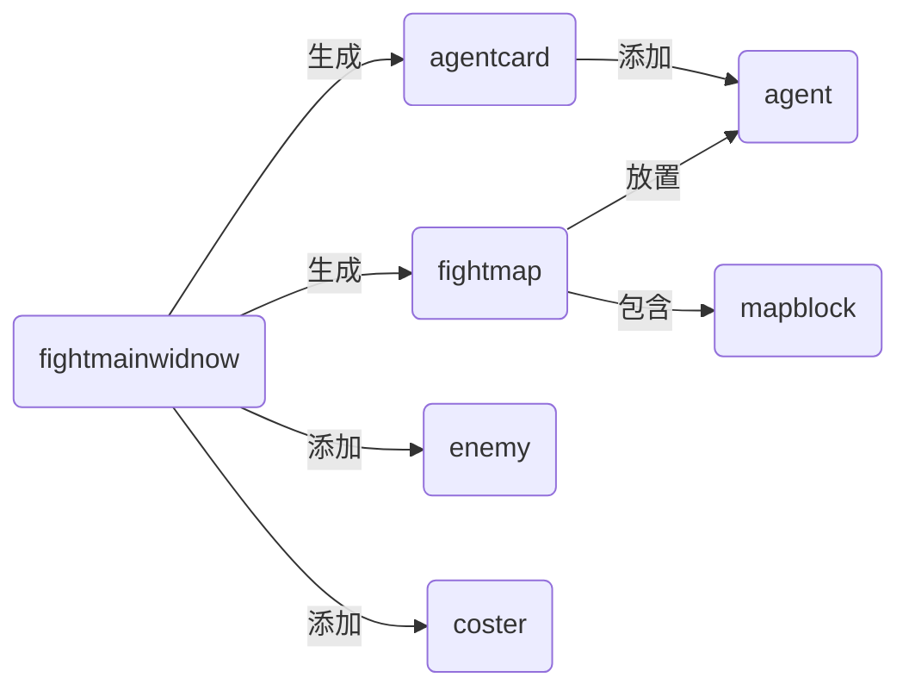

# Report for project2 of Medium CPP

191250145 王子鉴

## 整体构架

### 文件构成

```bash
.
├── README
├── Source.qrc
├── arknights.pro
├── arknights.pro.user
├── content
│   ├── Agent								#我方干员
│   │   ├── CHSkadi
│   │   │   └── CHSkadi_2.png				#此干员目前尚未实现
│   │   ├── Exusiai							#能天使 高台单位 可以对空 物理伤害
│   │   │   ├── Attack\ .gif
│   │   │   ├── Dead.gif
│   │   │   ├── Painting_0.png
│   │   │   ├── Placing.png
│   │   │   ├── Portrait.png
│   │   │   ├── Start.gif
│   │   │   ├── Wait.gif
│   │   │   └── info
│   │   ├── Eyjafjalla						#艾雅法拉 高台单位 可以对空 法术伤害
│   │   │   ├── Attack.gif
│   │   │   ├── Dead.gif
│   │   │   ├── Painting_1.png
│   │   │   ├── Painting_2.png
│   │   │   ├── Placing.png
│   │   │   ├── Portrait.png
│   │   │   ├── Start.gif
│   │   │   ├── Wait.gif
│   │   │   └── info
│   │   ├── Melantha						#梅兰莎 地面单位 不能对空 物理伤害
│   │   │   ├── Attack-front.gif
│   │   │   ├── Attack_back.gif
│   │   │   ├── Dead_front.gif
│   │   │   ├── Painting_0.png
│   │   │   ├── Painting_1.png
│   │   │   ├── Placing.png
│   │   │   ├── Portrait.png
│   │   │   ├── Start_back.gif
│   │   │   ├── Start_front.gif
│   │   │   ├── Wait_back.gif
│   │   │   ├── Wait_front.gif
│   │   │   ├── info
│   │   │   └── ?\216??\205??\216\216-?\230认-?\210\230?\226\227正?\235?-Die-x1.gif
│   │   ├── Skadi							#斯卡蒂 同梅兰莎
│   │   │   ├── Attack.gif
│   │   │   ├── Dead.gif
│   │   │   ├── Painting_0.png
│   │   │   ├── Painting_2.png
│   │   │   ├── Placing.png
│   │   │   ├── Portrait.png
│   │   │   ├── Start.gif
│   │   │   ├── Wait.gif
│   │   │   └── info
│   │   └── SliverAsh						#银灰 地面单位 可以对空 物理伤害
│   │       ├── Attack.gif
│   │       ├── Combat.gif
│   │       ├── Dead.gif
│   │       ├── Painting_1.png
│   │       ├── Painting_2.png
│   │       ├── Placing.png
│   │       ├── Portrait.png
│   │       ├── Start.gif
│   │       ├── Wait.gif
│   │       └── info
│   ├── Enemy								#敌人
│   │   ├── Defence4						#御4 空中单位 特性：在场所有敌人回血
│   │   │   ├── Move.gif
│   │   │   └── None.gif
│   │   ├── Ghost							#幽灵 地面单位 特性：无法被阻挡
│   │   │   ├── Dead.gif
│   │   │   └── Move.gif
│   │   ├── MonsterSKII						#妖怪SKII 空中单位
│   │   │   ├── Attack.gif
│   │   │   ├── Dead.gif
│   │   │   ├── Move.gif
│   │   │   └── None.gif
│   │   ├── Soldier							#士兵 普通的地面单位
│   │   │   ├── Soldier_Atk.gif
│   │   │   ├── Soldier_Dead.gif
│   │   │   ├── Soldier_Move.gif
│   │   │   └── Soldier_None.gif
│   │   ├── UAV								#无人机 空中单位 无法攻击我方干员
│   │   │   ├── Atk.gif
│   │   │   ├── Dead.gif
│   │   │   ├── Move.gif
│   │   │   └── None.gif
│   │   └── Warlock							#术士 地面单位 可以攻击我方高台干员
│   │       ├── Attack.gif
│   │       ├── Dead.gif
│   │       ├── Move.gif
│   │       └── None.gif
│   ├── Map									#地图信息
│   │   ├── 0-1
│   │   │   ├── fig							#地图每种格子的图片
│   │   │   │   ├── 0.png
│   │   │   │   ├── 1.png
│   │   │   │   ├── 2.png
│   │   │   │   ├── 3.png
│   │   │   │   └── 4.png
│   │   │   └── info
│   │   │       ├── enemyinfo				#敌人 包括行走路线和出场时间
│   │   │       └── info					#地图信息，包括每个格子的图片和放置高台/地面干员
│   │   └── Coster.png						#cost的图片
│   └── OtherImage							#其他测试图片和后续的主界面的元素图片
│       ├── button.jpg
│       └── foo.png
├── header									#头文件
│   ├── agent
│   │   ├── agent.h
│   │   ├── agentatkarea.h					#干员攻击范围
│   │   ├── agentcard.h						#下方放置干员的图标
│   │   ├── exusiai.h				
│   │   ├── eyjafjalla.h
│   │   ├── melantha.h
│   │   ├── placeagent.h					#放置干员的中间态，可以控制方向
│   │   ├── silverash.h
│   │   └── skadi.h
│   ├── common.h
│   ├── enemy
│   │   ├── defence4.h
│   │   ├── enemy.h
│   │   ├── ghost.h
│   │   ├── skii.h
│   │   ├── soldier.h
│   │   ├── uav.h
│   │   └── warlock.h
│   ├── mainwindow
│   │   ├── jumpbutton.h
│   │   └── mainwindow.h
│   └── map
│       ├── coster.h						#cost部分
│       ├── fightmainwindow.h				#fight主界面
│       ├── fightmap.h						#战斗地图
│       └── mapblock.h						#地图上的块
├── main.cpp
├── mainwindow.ui
├── report
│   └── report\ for\ project2\ of\ medium\ cpp.md
└── source									#源文件信息
    ├── agent
    │   ├── agent.cpp
    │   ├── agentatkarea.cpp
    │   ├── agentcard.cpp
    │   ├── exusiai.cpp
    │   ├── eyjafjalla.cpp
    │   ├── melantha.cpp
    │   ├── placeagent.cpp
    │   ├── silverash.cpp
    │   └── skadi.cpp
    ├── enemy
    │   ├── defence4.cpp
    │   ├── enemy.cpp
    │   ├── ghost.cpp
    │   ├── skii.cpp
    │   ├── soldier.cpp
    │   ├── uav.cpp
    │   └── warlock.cpp
    ├── mainwindow
    │   ├── jumpbutton.cpp
    │   └── mainwindow.cpp
    └── map
        ├── coster.cpp
        ├── fightmainwindow.cpp
        ├── fightmap.cpp
        └── mapblock.cpp
```

### 设计

1. 所有干员的信息都是通过文件读写来操作的，这样可以在后面增加养成机制和抽卡机制，文件是``/content/xxx/info`，xxx为干员的英文名，以干员Melantha(梅兰莎)为例

```bash
name = Melantha					#名称			
elite = 0						#精英化
level = 1						#等级
RedeployTime = 70				#再部署时间
cost = 13						#部署费用，后续可能改成链表，因为每次撤退后再部署时间不同
maxresistnum = 1				#最大阻挡数
trust = 0						#信赖
rarity = 3						#稀有度
place = 1						#干员放置信息，1为地面, 2为高台, 3高台地面都可以
totalhp = 1395					#干员生命上限
phydefence = 83					#防御
magdefence = 0					#法术抗性
attack = 396					#攻击
atktype = 1						#攻击种类，1为物理，2为法术，3为真实伤害
atkradius = 0					#攻击半径 目前尚没用到的变量
atkspeed = 100					#攻击速度，目前还没有用到的机制
atkInterval = 1.5				#攻击间隔，单位(s)
atkRangeBlockNum = 2			#攻击范围的方块数
0 0								#攻击范围的块的坐标(朝向为右时)
1 0
```

2. 所有地图都也是通过文件读写来操作的，方便地图之间的转换，只要修改`fightmainwindow`中`fightname`就可以控制打开某一关。文件是位于`content/xxx/info`文件夹中的`info`, xxx为战斗名称(fightname)

   ```bash
   5					#图片种类个数
   9 5 128 128			#分别为长的格子个数，宽的格子个数，格子的长，格子的宽
   0 2 2 2 2 2 2 2 0	#每个格子对应的图片
   3 1 2 1 1 1 1 1 0
   0 1 1 1 2 1 1 1 4
   0 2 2 2 2 2 2 2 0
   0 0 0 0 0 0 0 0 0
   
   0 2 2 2 2 2 2 2 0	#每个格子对应的信息 0不可放置 1地面 2高台 3终止点 4
   3 1 2 1 1 1 1 1 0
   0 1 1 1 2 1 1 1 4
   0 2 2 2 2 2 2 2 0
   0 0 0 0 0 0 0 0 0
   ```

   

3. 所有敌人的属性是内置的，在每个敌人的构造函数中，但敌人的移动信息是在`content/xxx/info`中的`enemyinfo`

   ```bash
   13							#一共n个敌人，接下来是2n行
   2 0 128 128 8 2				#依次为出现的时间(s), 敌人种类，width，height，开始的格子
   11 3 3 0 3 3 3 2 3 3 0 3	#每次移动开始和结束都是在格子中间，13为移动次数，之后13个0-4，为移动方向
   #0-up, 1-right, 2-down, 3-left
   ```

4. 所有空中单位都不能被阻拦，计算造成的伤害的机制为

   ```c++
   typedef int AttackType;
   enum {
       AttackType_None = 0,
       AttackType_Physical,
       AttackType_Magic,
       AttackType_Real
   };
   
   void Agent::attackedByOther(qreal dmg, AttackType typ)
   {
       if (typ == AttackType_Physical) 			//物理伤害减防御与30取max
           hp -= fmax(30, dmg - phydefence); 		
       else if (typ == AttackType_Magic) 			//法术伤害乘(1 - 法术抗性)与0.01的max
           hp -= dmg * fmax(0.01, 1 - magdefence);	
       else {
           assert(atktype = AttackType_Real);
           hp -= dmg;								//真实伤害直接扣
       }
   }
   ```

5. 敌人有被阻拦需要消耗的阻拦数，需要干员的最大阻拦数-当前阻拦数>=此敌人的阻拦数，敌人才会被阻拦，有些敌人无法阻拦
6. 拖动下方的agentcard来放置干员，放到某个格子上后，按住左键，向上下左右四个方向拖动后松开，以确定干员朝向，干员放置的条件是：cost大于干员的部署费用，如果不是第一次部署，需要等到冷却后才能再部署

### 模块间的逻辑




具体构成的逻辑关系如上所示

fightmainwindow会在文件中读取所要用到的信息，然后用来生成各种元素

之后的交互全都是模块和fightmap之间的交互来完成，包括agentcard和placeagent，placeagent和agent的构造

## 具体实现方式

这里不再大量粘贴代码，只挑游戏逻辑中重要的来说明，有删改

如果没有必要，或者嫌烦，可以跳过此部分

### fightmainwindow

主要在于构造函数中的内容，具体不同地方的不同作用可以看注释

```C++
FightMainWindow::FightMainWindow(QWidget *parent, QString fightname)
    : QMainWindow(parent)
    , scene(new QGraphicsScene(this))
    , view(new QGraphicsView(scene, this))
    , timer(new QTimer)
    , fightname(fightname)
{
    //information should offered to constructor
    int fig_num;
    int x_num, y_num;
    int window_width, window_height;
    QVector<QVector<int> > map_fig, map_state;//the fig and state of each block

    //handle the info
    //offer the figure of each block first, then the state
    qsrand(uint(QTime(0,0,0).secsTo(QTime::currentTime())));
    QFile info(":/map/" + fightname + "/info");
    if (info.open(QFile::ReadOnly)) {
        //... read the file
    }
    else {
        qDebug() << "can't resolve the map info: /map/" + fightname + "/info";
        assert(0);
    }
    //handle the wihndow
    window_width = x_num * block_width, window_height = y_num * block_height + CUSTOM_AGTCARD_HEIGHT;
    //handle the map

    this->setFixedSize(window_width, window_height);
    scene->setSceneRect(0, 0, window_width, window_height);

    QVector<QPixmap *> appear;
    for (int i = 0; i < fig_num; i++) {
        appear.push_back(new QPixmap(":/map/" + fightname +"/" + QString::number(i)));
    }
    QVector<QPair<int, int> > emp;
    QVector<QVector<QPair<int, int> > >block2fig;
    //block2fig require fig num first, state second
    for (int i = 0; i < y_num; i++) {
        block2fig.push_back(emp);
        for (int j = 0; j < x_num; j++) {
            block2fig[i].push_back({map_fig[i][j], map_state[i][j]});
        }
    }
    fightmap = new FightMap(0, 0, x_num, y_num, block_width, block_height, appear, block2fig);
    scene->addItem(fightmap);

    //handle the enemy
    enemyinfo = HandleEnemyInfo();

    //handle the coster
    coster = new Coster(99, 99, 1.0, block_width * x_num, block_height* y_num);
    scene->addItem(coster);
    fightmap->coster = coster;

    //handle the agentcard
    //TODO
    //add new agent
    fightmap->addAgentCard("Eyjafjalla");
    fightmap->addAgentCard("SilverAsh");
    fightmap->addAgentCard("Skadi");
    fightmap->addAgentCard("Melantha");
    fightmap->addAgentCard("Exusiai");

    //connect the timer with function
    view->resize(window_width, window_height);
    connect(timer, &QTimer::timeout, scene, &QGraphicsScene::advance);
    connect(timer, &QTimer::timeout, this, &FightMainWindow::addEnemy);

    timer->start(TOTALNEWMSEC);
    view->show();
}
```

### FightMap

主要作用就是处理drop事件，和管理干员(Agent/AgentCard)及其中间体

```C++
void FightMap::dropEvent(QGraphicsSceneDragDropEvent *event)
{
    if (event->mimeData()->hasText()) {
        if (event->mimeData()->hasImage()){			//通过有没有图片来区分是拖动agentcard还是placeagent
            if (placingBlock) return;
            QString s = event->mimeData()->text();
            char name[30];
            qreal timenow, timeneed;
            int cost;
            AgentPlaceType placetype;
            std::string tmp = s.toStdString();
            std::sscanf(tmp.c_str(), "Timenow:%lf Timeneed:%lf Cost:%d Name:%s PlaceType:%d",&timenow, &timeneed, &cost, name, &placetype);
            //读dragebent传来的信息
            placingName = QString::fromStdString(std::string(name));
            if (timeneed * 1000 < timenow and coster->cost >= cost) {
                placingPos = mapToScene(event->pos());
                int posx = placingPos.x(), posy = placingPos.y();
                posx = (posx / width) * width, posy = (posy / height) * height;
                int block_x = posx / width, block_y = posy / height;

                //handle the wrong placing of agent
                //高台干员放在了地面上或者地面干员放在了高台上都直接返回
                //...

                placingPos.setX(posx), placingPos.setY(posy);
                addPlaceAgent(placingName, placingPos, posx / width, posy / height);
                coster->cost -= cost;
                placingBlock = true;
            }
        }
        else {
            assert(placingBlock);
            QPointF pos = mapToScene(event->pos());
            //确定位置
            int posx = pos.x(), posy = pos.y();
            qreal cx = placingPos.x() + CUSTOM_ATK_WIDTH / 2;
            qreal cy = placingPos.y() + CUSTOM_ATK_HEIGHT / 2;
            qreal dx = posx - cx;
            qreal dy = posy - cy;
            if (abs(dx) > abs(dy)) addAgent(placingName, placingPos, placingPos.x() / width, placingPos.y() / width, {dx / abs(dx), 0});
            else addAgent(placingName, placingPos, placingPos.x() / width, placingPos.y() / width, {0, dy / abs(dy)});
            //确定朝向
            assert(deleteAgentCard(placingName));		//从agentcard的容器中删除此干员
            placingBlock = false;
            delete placingTmpAgent;
        }
    }
    update();
}
```

### Agent

反映逻辑主要在advance函数中，先处理特殊状态，再根据攻击的敌人设置状态，然后作出相应的reaction

```C++
void Agent::advance(int phase)
{
    if (!phase) return;
    update();
    assert(state != AgentState_None and state != AgentState_None2);
    //先处理特殊状态
    if (state == AgentState_Start) {		//播放初始动画
        if (MovieCount > 0) MovieCount--;
        else {
            setStateWait();
            update();
            return;
        }
    }
	//判定为死亡时，设置状态为死亡，同时处理阻挡的敌人和攻击的敌人
    if (hp <= 0 and state != AgentState_Dead) {		
        clearResAtkObject();
        //set self dead
        setStateDead();
        return;
    }
    //display the dead movie
    if (state == AgentState_Dead) {
        if (MovieCount > 0) {
            MovieCount --;
            return;
        }
        else {
            FightMap * tmp = static_cast<FightMap *>(parent);
            tmp->deleteAgentSet(this);
            //TODO
            //if exit with no reason, try delete next line
            tmp->addAgentCard(name);
            delete this;
            return;
        }
    }
    selectAttackItem();
    //选择被攻击的敌人
    //并根据范围内的敌人来作出状态的改变和后续的攻击
    if (atkEnemy.empty()) {
        if (state != AgentState_Wait) setStateWait();
    }
    else if (state != AgentState_Atk) setStateAtk();
    if (state == AgentState_Atk) attackOther();
}
```

### Enemy

enemy的逻辑大体上和agent相似，也是先处理特殊状态，再根据阻拦/攻击的干员设置状态，然后作出相应的reaction，但有更多状态

```C++
void Enemy::advance(int phase)
{
    if (!phase) return;
    update();
    //处理没血了的情况
    if (hp <= 0 and state != EnemyState_Dead) {
        //delete the resist agent
       //...
        //delete the attack item
        //...
        //delete the attacked item
        //...
        setStateDead();
        update();
        return;
    }
    if (state == EnemyState_Dead) {			//播放死亡动画
        if (movieFrameCount > 0) {
            movieFrameCount --;
            update();
            return;
        }
        else {
            update();
            delete this;
            return;
        }
    }
    selectResistItem();						//选择阻挡对象
    selectAtkItem();						//选择攻击对象
    //如果没有阻挡，能远程攻击就设置状态为moveatk(边走边攻击)，否则设置为move
    if (resistAgent.empty()) {
        if (state != EnemyState_Move and not longDistanceAtk) setStateMove();
        if (state != EnemyState_MoveAttack and longDistanceAtk) setStateMoveAtk();
    }
    //如果有阻挡，并且攻击范围内有人，设置状态为攻击，否则设置为不动(后续敌人特殊攻击机制需要)
    else {
        if (not atkAgent.empty() and state != EnemyState_Attack) setStateAtk();
        else if (atkAgent.empty() and state != EnemyState_None) setStateNone();
    }
    if (state == EnemyState_Attack) {
        attackOther();
    }
    else if (state == EnemyState_Move) move();
    else if (state == EnemyState_MoveAttack) moveAtk();
    else if (state == EnemyState_None) assert(0);
    else assert(0);
}
```

## 碰到的问题

1. `agent`和`enemy`有很多行为相似的地方，存在很多代码复用，应该有更好的设计方式

2. `fightmainwindow`和`fightmap`可以合并为一个东西，project1的遗留问题

3. 有一个bug找了很久，在agent的advance中，如果先处理后update，可能会遇到死亡后删除自己，然后异常退出(概率出现)，尝试寻找执行流后好像是调用了空指针，调整到一开始就update后也是概率出错，但不调用上层的addAgentCard后则不会出错，又略微修改一下逻辑后可以正常运行了

4. 还有一个bug是远程单位可能在能攻击后会卡在一个地方不停播放走的gif，但不会攻击，输出中间状态后发现是15行(原本代码为`atkMovieCounter == movieFrameCount`)的`atkMoveCounter`可能会超过movieFrameCount造成死循环

   ```C++
   void Enemy::moveAtk()
   {
       if (atkTimeCounter <= atkInterval * 1000)  {
           atkTimeCounter += TOTALNEWMSEC;
           move();
           atkMovieCounter = 0;
       }
       else {
           if (atkAgent.empty()) {
               move();
               return;
           }
           if (atkMovieCounter == 0) setMovie(":/enemy/" + name + "/Atk");
           atkMovieCounter++;
           if (atkMovieCounter >= movieFrameCount) {
               atkTimeCounter -= atkInterval * 1000;
               atkMovieCounter = 0;
               setMovie(":/enemy/" + name + "/Move");
               if (not atkAgent.empty()) {
                   Agent * agent = qgraphicsitem_cast<Agent *>(atkAgent[0]);
                   agent->attackedByOther(attack, atktype);
               }
               else assert(0);
               return;
           }
       }
   }
   ```

5. 代码风格问题，以及封装的问题。没教继承直接写的第一个阶段，导致所有成员变量都是public，模块之间的交互很多，太过复杂，重构后几乎控制了所有的类不会直接访问其他类，只能通过提供的接口来操作(enemy派生类重写atkother函数除外)。同时之前的代码命名不统一，之后会尽量统一，包括
   1. 特殊全局变量用全大写，如`common.h`中的TOTALNEWMSEC(更新的毫秒数)
   2. 类/自定义类型名称使用大驼峰式命名，如`AgentCard`
   3. 类中成员变量、成员函数使用小驼峰式命名，如`agent.h`中的`selectAtkEnemy`
   4. 局部变量尽量赋予少的含义，并且用`_`来分割

6. 干员的攻击范围目前还只能是矩形，之后需要重写collidingwithitem函数来实现更多的特殊形状攻击范围

## 个人觉得有趣的地方

1. 我的干员攻击范围是用复数来实现的，并且再赋予朝向后，直接把范围的坐标乘朝向就可以了
2. 改写了pro文件，让整个文件更加清晰：header存储头文件，source存储cpp文件，content为游戏内信息和图片/gif存储